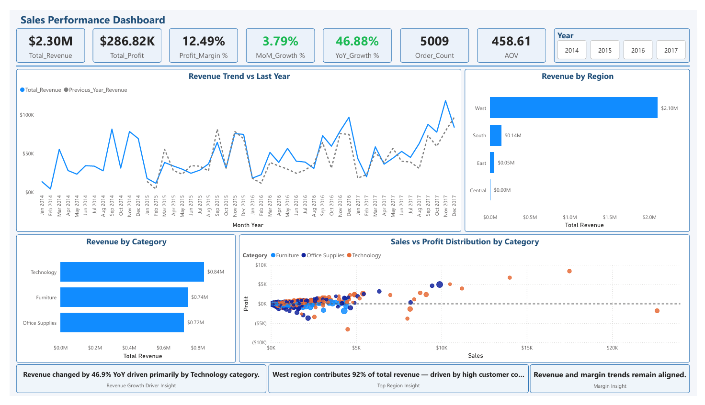
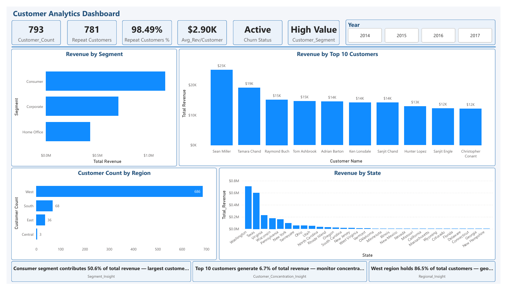
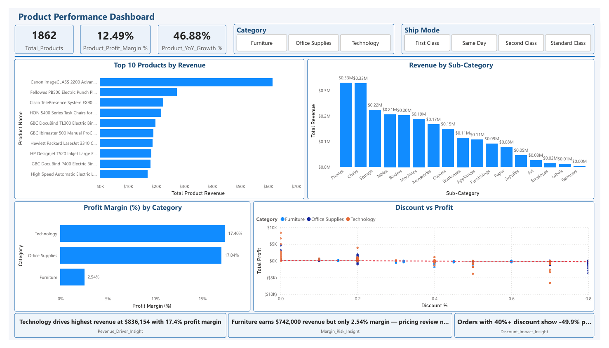

# Superstore Sales Analytics — End-to-End BI Solution

## Overview
End-to-end Business Intelligence solution analyzing 
$2.3M sales data across 5009 orders and 793 customers.

## Tools Used
- SQL Server
- Microsoft Power BI (DAX)
- Power Query
- Python

## Dashboard Pages
- Page 1 — Sales Performance
- Page 2 — Customer Analytics  
- Page 3 — Product Performance

## Dashboard Preview




## Power BI Dashboard
[View Live Dashboard](https://app.powerbi.com/links/goWtfGlV_y?ctid=7f53d9f5-c01e-4d5c-b5f9-611df8e81fcf&pbi_source=linkShare)

## Key Insights
- Technology drives highest revenue at $836K
- 46.88% YoY growth
- 98.49% repeat customer rate
- High discounts above 40% result in negative profit
```

5. Click **Commit changes** ✅

---

## Step 6 — Copy Your GitHub Link

Your repository link will be:
```
https://github.com/gauravdeshmukh18/Superstore-Sales-Analytics
```

---

## Step 7 — Add Links to Resume (2 minutes)

Come back here and tell me — I'll add both links to your resume in 2 minutes:
- GitHub repo link
- Power BI dashboard link

---

## Step 8 — Add to Naukri Profile

1. Go to **naukri.com**
2. Edit your profile
3. Go to **Projects section**
4. Find Superstore project
5. Add in URL field:
```
https://github.com/gauravdeshmukh18/Superstore-Sales-Analytics
```

---

## About Power BI Public Link

Brother your current link:
```
[https://app.powerbi.com/links/goWtfGlV_y?ctid=...](https://app.powerbi.com/links/XZdMFmG14G?ctid=7f53d9f5-c01e-4d5c-b5f9-611df8e81fcf&pbi_source=linkShare)
